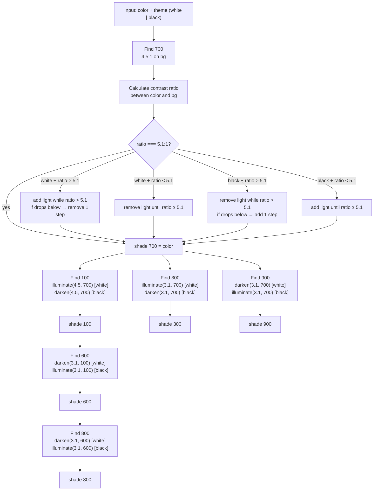

# accessible-color-palette

[](https://www.npmjs.com/package/accessible-color-palette)

A TypeScript library that generates **WCAG 2.2 AA compliant monochromatic palettes** from any hex color. The palette algorithm has no external dependencies — the WCAG math is implemented directly.

Given a hex color and a background theme (`'white'` | `'black'`), it produces 6 shades — **100, 300, 600, 700, 800, 900** — where every shade meets contrast requirements against the theme. It also returns a usage map describing which shade pairs pass AA for normal text (4.5:1) and which pass for large text / UI components (3:1).

Ships as an ESM library, a **CLI**, and an **MCP server** for use with AI assistants.

---

## Install

```bash
npm install accessible-color-palette
```

---

## Usage

### As a CLI

```bash
npx accessible-color-palette <hex> <theme> [options]
```

| Argument / Option | Description |
|-------------------|-------------|
| `hex` | Hex color — with or without `#`, 3 or 6 chars |
| `theme` | Background theme: `white` \| `black` |
| `--prefix <name>` | CSS variable prefix (default: `color`) |
| `--json` | Output full palette + usage map as JSON |
| `-h, --help` | Show help |

```bash
# CSS tokens with WCAG manifest (default)
npx accessible-color-palette 1F7A54 white

# Custom prefix
npx accessible-color-palette 1F7A54 white --prefix brand

# Raw JSON
npx accessible-color-palette 1F7A54 white --json
```

Output (default):

```css
/*
 * WCAG AA PAIRING MANIFEST — source: #1f7a54 · theme: white
 *
 * BODY TEXT (any font size, ≥4.5:1):
 *   shade-700 (#207c55) → white, 100
 *   shade-800 (#124630) → white, 100, 300
 *   ...
 */
:root {
  --color-100: #e3f8ef; /* ✅ text→900·800·700  ⚠️ lg→600 */
  --color-700: #207c55; /* ✅ text→white·100  ⚠️ lg→300·900 */
  ...
}
```

---

### As a library

```ts
import { generatePalette, toCSSTokens } from 'accessible-color-palette'

const result = generatePalette('#1F7A54', 'white')

// Each shade includes hex, RGB and HSL values
console.log(result.palette['700'])
{
  hex: '#1f7a54',
  rgb: { r: 31, g: 122, b: 84 },
  hsl: { h: 152, s: 59, l: 30 }
}

// Usage map: for each shade, which backgrounds pass for normal text and large text
console.log(result.usage['700'].normalText)
[
  { key: '100', hex: '#d6f5e8', ratio: 4.18 },
  { key: 'background', hex: '#ffffff', ratio: 5.10 },
  ...
]

console.log(result.usage['700'].largeText)
[{ key: '300', hex: '#71dbae', ratio: 3.21 }, ...]

// CSS tokens
console.log(toCSSTokens(result))
--color-100: #d6f5e8;
--color-300: #71dbae;
--color-600: #259868;
--color-700: #1f7a54;
--color-800: #10422d;
--color-900: #082116;

// Custom prefix
console.log(toCSSTokens(result, 'brand'))
--brand-100: #d6f5e8;
// ...

// Validate a list of foreground/background shade pairs before you use them
import { validatePairings } from 'accessible-color-palette'

const report = validatePairings(result, [
  { foreground: '700', background: 'white' },
  { foreground: '100', background: '900' },
])
console.log(report.allPass)        // true
console.log(report.pairings[0])    // { level: 'aa-normal', message: '✓ ...', ... }

// Check contrast between any two arbitrary hex colors — e.g. a brand accent
// that isn't part of the generated palette
import { checkContrast } from 'accessible-color-palette'

console.log(checkContrast('#ffffff', '#c75d3a'))
{
  foreground: '#ffffff',
  background: '#c75d3a',
  ratio: 4.15,
  level: 'aa-large',
  message: '⚠ #ffffff on #c75d3a: 4.15:1 — AA large text only (3:1–4.5:1) ...'
}
```

### As an MCP server

Add it to your MCP client config (Claude Desktop, Cursor, etc.) — no installation required:

```json
{
  "mcpServers": {
    "accessible-color-palette": {
      "command": "npx",
      "args": ["-y", "accessible-color-palette"]
    }
  }
}
```

Or install globally and point to the binary:

```bash
npm install -g accessible-color-palette
```

```json
{
  "mcpServers": {
    "accessible-color-palette": {
      "command": "accessible-color-palette-mcp"
    }
  }
}
```

There are two ways to use the MCP server.

---

#### Option A — Direct tool use

Call the tools yourself, or let the model use them freely. Good for querying palette data or generating tokens when you're in control of the flow.

| Tool | Description |
|------|-------------|
| `generate_palette` | Returns the full palette + usage map as JSON |
| `validate_pairings` | Validates a list of foreground/background shade pairs — returns `proceed: false` if any pair fails |
| `generate_css_tokens` | Returns a CSS `:root {}` block with inline WCAG comments per shade. **Requires `validate_pairings` to have passed for the same hex+theme earlier in the session** — it throws otherwise (server-side gate, not just a convention) |
| `check_contrast` | Standalone contrast check between any two hex colors, independent of any generated palette. Use it for accent colors (a status/brand hex that is NOT one of the foundation shades) — `validate_pairings` only knows shade keys and white/black, so it can't check an arbitrary hex |

> [!NOTE]
> The 100–900 scale this server generates is the **foundation layer** of a palette, not necessarily the whole thing. Most real interfaces also need 1–2 semantic accent colors (error/success/warning/sale) that the monochrome scale can't express — that's what `check_contrast` is for. Don't read "monochromatic" in this project's name as "never use any other color in the UI."

> [!WARNING]
> `generate_css_tokens` returns the `:root {}` block with the WCAG comments soldered to each variable, plus an explicit instruction to copy it **verbatim**. That instruction is in the response text precisely because some models otherwise reformat the output and drop the comments while keeping the hex values — which silently throws away the only record of which pairings are safe. If you're calling this tool directly rather than letting an agent drive, keep the comments when you paste the block into your CSS.

There's also a resource template you can read directly:

```
palette://{hex}/{theme}
```

Returns the full WCAG compatibility matrix as JSON — useful as a reference before making color decisions.

---

#### Option B — Guided prompt (recommended for design tasks)

When you delegate a design task to an AI agent, use the `plan-palette-usage` prompt instead of calling tools directly. The prompt injects a strict 4-step workflow:

1. Read the compatibility matrix (even if read earlier in the conversation)
2. Document every planned color pairing inside a `<thinking>` block and check each one
3. Call `validate_pairings` — the model is **blocked** until all pairs pass
4. Only then call `generate_css_tokens`

This prevents models from combining colors based on 'intuition' or prior examples, which is the most common cause of inaccessible AI-generated CSS.

**Example instruction to your agent:**

> "Use the `plan-palette-usage` prompt with hex=`1f7a54` and theme=`white`, then design a user profile card."

> [!NOTE]
> **MCP prompts are user-controlled by spec, not model-controlled like tools.** That's true for every MCP client, not a Claude Code limitation: a model can never invoke `plan-palette-usage` on its own just because you asked it to in natural language ("use the prompt X") — only a human typing the actual slash command triggers it. In Claude Code that's `/mcp__accessible-palette__plan-palette-usage <hex> <theme>`; it shows up in the autocomplete and runs like any other prompt. Cline exposes the same capability through its own UI. So Option B is reachable everywhere MCP prompts are supported — it just always requires a human to type it, in every client, by design.
>
> Because of that, anything that needs to happen without a human typing a slash command — i.e. the model acting on its own — cannot rely on a prompt. That's why, since **v2.2.0**, the validate-before-generate order is also enforced **server-side**: `generate_css_tokens` will reject the call (throw) for a given hex+theme until `validate_pairings` has returned `proceed: true` for that exact hex+theme earlier in the same session. The model cannot get CSS tokens out of this server without validation having passed first, whether or not anyone ever types the prompt. The prompt remains useful on top of that because it also enforces the matrix re-read and the explicit `<thinking>` cross-check — steps no server-side gate can compel — but the accessibility guarantee itself does not depend on it.

---

## Output shape

```ts
interface PaletteResult {
  palette: Record<'100' | '300' | '600' | '700' | '800' | '900', {
    hex: string
    rgb: { r: number; g: number; b: number }  // 0–255
    hsl: { h: number; s: number; l: number }  // h: 0–360, s/l: 0–100
  }>
  usage: Record<'100' | '300' | '600' | '700' | '800' | '900', {
    hex: string
    normalText: Array<{ key: string; hex: string; ratio: number }>
    largeText:  Array<{ key: string; hex: string; ratio: number }>
  }>
  theme: 'white' | 'black'
  sourceColor: string
}
```

- `normalText` — backgrounds where this shade passes at **4.5:1** or better (body text, small UI)
- `largeText` — backgrounds where this shade passes at **3:1–4.49:1** (headings, large text, icons)
- Failing combinations (< 3:1) are omitted entirely
- `key` is a shade (`'100'`–`'900'`) or `'background'` (white or black, depending on theme)

---

## Example output

**`generatePalette('#1F7A54', 'white')`**

| Shade | Hex | RGB | HSL |
|-------|-----|-----|-----|
| 100 | `#d6f5e8` | `214, 245, 232` | `152°, 62%, 90%` |
| 300 | `#71dbae` | `113, 219, 174` | `152°, 59%, 65%` |
| 600 | `#259868` | `37, 152, 104` | `152°, 61%, 37%` |
| 700 | `#1f7a54` | `31, 122, 84` | `152°, 59%, 30%` |
| 800 | `#10422d` | `16, 66, 45` | `152°, 61%, 16%` |
| 900 | `#082116` | `8, 33, 22` | `152°, 61%, 8%` |

**`generatePalette('#239062', 'black')`** — dark theme inverts the lightness direction

| Shade | Hex | RGB | HSL |
|-------|-----|-----|-----|
| 100 | `#061911` | `6, 25, 17` | `152°, 61%, 6%` |
| 300 | `#0e3927` | `14, 57, 39` | `152°, 61%, 14%` |
| 600 | `#1c734e` | `28, 115, 78` | `152°, 61%, 28%` |
| 700 | `#239062` | `35, 144, 98` | `152°, 61%, 35%` |
| 800 | `#4fd498` | `79, 212, 152` | `152°, 59%, 57%` |
| 900 | `#b9eed8` | `185, 238, 216` | `152°, 62%, 83%` |

For `theme: 'black'`, shade 100 is the darkest. The lightness order is inverted relative to `theme: 'white'` — this is by design.

---

## How the algorithm works

### The core primitive

Every shade is found by the same iterative mechanism: start from a color, walk its HSL lightness in steps of 0.5%, and stop when the WCAG 2.2 contrast ratio against a reference color reaches the target.

```
stepTowardRatio(startHex, referenceHex, targetRatio, direction)
  1. Convert startHex to HSL
  2. Adjust lightness +/- 0.005 per step
  3. After each step: compute contrastRatio(current, referenceHex)
  4. Stop when ratio >= targetRatio
  5. Safety limit: throw after 1000 steps
```

Contrast is always computed using the **exact WCAG 2.2 formula** — no approximations, no HSL lightness shortcuts.

### Shade derivation chain

700 is the anchor. Everything else derives from it (or from a shade that derived from it).

```
inputHex --> find700 --> shade700 --> find100 --> shade100 --> find600 --> shade600 --> find800 --> shade800
                    |                                                |
                    |--> find300 --> shade300                       +- (reference for 600 and 800)
                    |
                    +--> find900 --> shade900
```

### Decision flowchart



### Shade-by-shade contract

| Shade | Derived from | Target contrast | Direction (white bg) |
|-------|-------------|-----------------|----------------------|
| 700 | inputHex | 5.1:1 vs background | darken if too light, lighten if too dark |
| 100 | shade700 | 4.5:1 vs shade700 | lighten |
| 300 | shade700 | 3.1:1 vs shade700 | lighten |
| 600 | shade100 | 3.1:1 vs shade100 | darken |
| 800 | shade600 | 3.1:1 vs shade600 | darken |
| 900 | shade700 | 3.1:1 vs shade700 | darken |

---

## Design principles

- **No classes.** Purely functional — no `class`, no `new`, no `this`.
- **No mutation.** Every function returns a new value.
- **No external color libraries.** The WCAG math is ~25 lines, implemented directly.
- **Strict TypeScript.** `strict: true`, branded `HexColor` type to prevent raw strings leaking through the API.
- **Pure functions.** Same input, same output. The only side effects are in `src/mcp/server.ts`.
- **Single responsibility.** Each function does exactly one thing.

---

## API reference

### `generatePalette(hex: string, theme: 'white' | 'black'): PaletteResult`

The main entry point. Accepts a raw hex string with or without `#`, 3 or 6 chars. Throws `Error` for invalid hex with a message that includes the invalid value.

### `toCSSTokens(result: PaletteResult, prefix?: string): string`

Generates CSS custom property declarations from a `PaletteResult`. Default prefix is `'color'`. Does not wrap in `:root {}` — the caller decides placement.

### `validatePairings(result: PaletteResult, pairings: Array<{ foreground: string; background: string }>): ValidationReport`

Checks a list of foreground/background shade pairs against `result`'s compatibility matrix. `foreground` must be a shade key (`100 | 300 | 600 | 700 | 800 | 900`); `background` can be a shade key, `'white'`, or `'black'`. Returns `{ summary, allPass, pairings }` — each pairing gets a `level` (`'aa-normal' | 'aa-large' | 'fail' | 'invalid'`) and a human-readable `message`. Same pure logic the MCP server's `validate_pairings` tool uses.

### `checkContrast(foregroundHex: string, backgroundHex: string): ContrastCheckResult`

Standalone WCAG 2.2 contrast check between any two hex colors — not tied to a generated palette. Use it for accent colors (brand colors, status colors) that aren't part of the monochrome scale. Returns `{ foreground, background, ratio, level, message }`.

---

## Running tests

```bash
npm test
npm run test:coverage
```

Uses [Vitest](https://vitest.dev/). Integration tests validate against known outputs from the original Figma test cases.

---

## Building

```bash
npm run build   # tsc -> dist/
npm run mcp     # start MCP server (requires build first)
```

No bundler required — the library ships ESM and Node resolves it natively.

---

## Migrating from v1

v2 is a full rewrite. The algorithm is the same but everything else changed — the API is not compatible.

**What changed:**

- No more classes. v1 used `AccessibleColorPalette.generatePalette(...)`. v2 uses named ESM exports.
- The output shape is different. v1 returned shade objects with a `compatibilities` key. v2 returns a `palette` object and a separate `usage` map.
- No external dependencies. v1 used `colorsys` and `@mdhnpm/color-contrast-ratio-calculator`. v2 implements the WCAG math directly.
- Ships an MCP server for use with AI assistants.

**v1 (old):**

```js
const AccessibleColorPalette = require('accessible-color-palette')
AccessibleColorPalette.generatePalette('#1c734e', 'black')
// → { "700": { compatibilities: { largeText: [...], smallText: [...] }, hex, rgb, hsl } }
```

**v2 (new):**

```ts
import { generatePalette } from 'accessible-color-palette'
generatePalette('#1c734e', 'black')
// → { palette: { "700": { hex, rgb, hsl } }, usage: { "700": { normalText: [...], largeText: [...] } }, theme, sourceColor }
```

v1 remains available on npm as `accessible-color-palette@1.x` but is no longer maintained.

---

## Credits

Algorithm by **Marta Herrera Hollingsworth**. Library and MCP by **Cecilia Olivera**.
