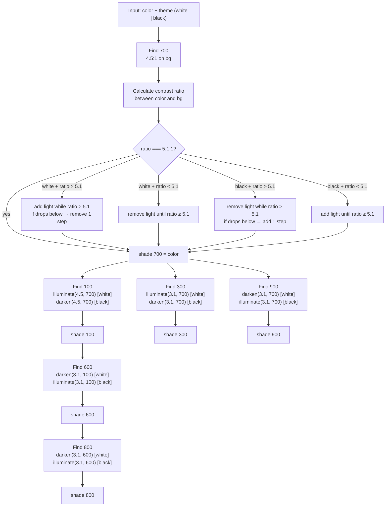

# accessible-color-palette

A zero-dependency TypeScript library that generates **WCAG 2.2 AA compliant monochromatic palettes** from any hex color.

Given a hex color and a background theme (`'white'` | `'black'`), it produces 6 shades — **100, 300, 600, 700, 800, 900** — where every shade meets contrast requirements against the theme. It also returns a usage map describing which shade pairs pass AA for normal text (4.5:1) and which pass for large text / UI components (3:1).

Ships as an ESM library and as an **MCP server** for use with AI assistants.

---

## Install

```bash
npm install accessible-color-palette
```

---

## Usage

### As a library

```ts
import { generatePalette, toCSSTokens } from 'accessible-color-palette'

const result = generatePalette('#1F7A54', 'white')

// Each shade includes hex, RGB and HSL values
console.log(result.palette['700'])
// {
//   hex: '#1f7a54',
//   rgb: { r: 31, g: 122, b: 84 },
//   hsl: { h: 152, s: 59, l: 30 }
// }

// Usage map: for each shade, which backgrounds pass for normal text and large text
console.log(result.usage['700'].normalText)
// [
//   { key: '100', hex: '#d6f5e8', ratio: 4.18 },
//   { key: 'background', hex: '#ffffff', ratio: 5.10 },
//   ...
// ]

console.log(result.usage['700'].largeText)
// [{ key: '300', hex: '#71dbae', ratio: 3.21 }, ...]

// CSS tokens
console.log(toCSSTokens(result))
// --color-100: #d6f5e8;
// --color-300: #71dbae;
// --color-600: #259868;
// --color-700: #1f7a54;
// --color-800: #10422d;
// --color-900: #082116;

// Custom prefix
console.log(toCSSTokens(result, 'brand'))
// --brand-100: #d6f5e8;
// ...
```

### As an MCP server

```bash
npm run build
npm run mcp
```

Connect any MCP-compatible client (Claude Desktop, Cursor, etc.) to the running server. Two tools are exposed:

| Tool | Description |
|------|-------------|
| `generate_palette` | Returns the full palette + usage map as JSON |
| `generate_css_tokens` | Returns ready-to-paste CSS custom property declarations |

---

## Output shape

```ts
interface PaletteResult {
  palette: Record<'100' | '300' | '600' | '700' | '800' | '900', {
    hex: string
    rgb: { r: number; g: number; b: number }  // 0–255
    hsl: { h: number; s: number; l: number }  // h: 0–360, s/l: 0–100
  }>
  usage: Record<'100' | '300' | '600' | '700' | '800' | '900', {
    hex: string
    normalText: Array<{ key: string; hex: string; ratio: number }>
    largeText:  Array<{ key: string; hex: string; ratio: number }>
  }>
  theme: 'white' | 'black'
  sourceColor: string
}
```

- `normalText` — backgrounds where this shade passes at **4.5:1** or better (body text, small UI)
- `largeText` — backgrounds where this shade passes at **3:1–4.49:1** (headings, large text, icons)
- Failing combinations (< 3:1) are omitted entirely
- `key` is a shade (`'100'`–`'900'`) or `'background'` (white or black, depending on theme)

---

## Example output

**`generatePalette('#1F7A54', 'white')`**

| Shade | Hex | RGB | HSL |
|-------|-----|-----|-----|
| 100 | `#d6f5e8` | `214, 245, 232` | `152°, 62%, 90%` |
| 300 | `#71dbae` | `113, 219, 174` | `152°, 59%, 65%` |
| 600 | `#259868` | `37, 152, 104` | `152°, 61%, 37%` |
| 700 | `#1f7a54` | `31, 122, 84` | `152°, 59%, 30%` |
| 800 | `#10422d` | `16, 66, 45` | `152°, 61%, 16%` |
| 900 | `#082116` | `8, 33, 22` | `152°, 61%, 8%` |

**`generatePalette('#239062', 'black')`** — dark theme inverts the lightness direction

| Shade | Hex | RGB | HSL |
|-------|-----|-----|-----|
| 100 | `#061911` | `6, 25, 17` | `152°, 61%, 6%` |
| 300 | `#0e3927` | `14, 57, 39` | `152°, 61%, 14%` |
| 600 | `#1c734e` | `28, 115, 78` | `152°, 61%, 28%` |
| 700 | `#239062` | `35, 144, 98` | `152°, 61%, 35%` |
| 800 | `#4fd498` | `79, 212, 152` | `152°, 59%, 57%` |
| 900 | `#b9eed8` | `185, 238, 216` | `152°, 62%, 83%` |

For `theme: 'black'`, shade 100 is the darkest. The lightness order is inverted relative to `theme: 'white'` — this is by design.

---

## How the algorithm works

### The core primitive

Every shade is found by the same iterative mechanism: start from a color, walk its HSL lightness in steps of 0.5%, and stop when the WCAG 2.2 contrast ratio against a reference color reaches the target.

```
stepTowardRatio(startHex, referenceHex, targetRatio, direction)
  1. Convert startHex to HSL
  2. Adjust lightness +/- 0.005 per step
  3. After each step: compute contrastRatio(current, referenceHex)
  4. Stop when ratio >= targetRatio
  5. Safety limit: throw after 1000 steps
```

Contrast is always computed using the **exact WCAG 2.2 formula** — no approximations, no HSL lightness shortcuts.

### Shade derivation chain

700 is the anchor. Everything else derives from it (or from a shade that derived from it).

```
inputHex --> find700 --> shade700 --> find100 --> shade100 --> find600 --> shade600 --> find800 --> shade800
                    |                                                |
                    |--> find300 --> shade300                       +- (reference for 600 and 800)
                    |
                    +--> find900 --> shade900
```

### Decision flowchart



### Shade-by-shade contract

| Shade | Derived from | Target contrast | Direction (white bg) |
|-------|-------------|-----------------|----------------------|
| 700 | inputHex | 5.1:1 vs background | darken if too light, lighten if too dark |
| 100 | shade700 | 4.5:1 vs shade700 | lighten |
| 300 | shade700 | 3.1:1 vs shade700 | lighten |
| 600 | shade100 | 3.1:1 vs shade100 | darken |
| 800 | shade600 | 3.1:1 vs shade600 | darken |
| 900 | shade700 | 3.1:1 vs shade700 | darken |

---

## Design principles

- **No classes.** Purely functional — no `class`, no `new`, no `this`.
- **No mutation.** Every function returns a new value.
- **No external color libraries.** The WCAG math is ~25 lines, implemented directly.
- **Strict TypeScript.** `strict: true`, branded `HexColor` type to prevent raw strings leaking through the API.
- **Pure functions.** Same input, same output. The only side effects are in `src/mcp/server.ts`.
- **Single responsibility.** Each function does exactly one thing.

---

## Project structure

```
src/
  types.ts              -- all TypeScript types and branded primitives
  math/
    color.ts            -- hex <-> RGB <-> HSL conversions
    contrast.ts         -- WCAG relative luminance + contrast ratio
  algorithm/
    primitives.ts       -- stepTowardRatio, lightenToRatio, darkenToRatio
    palette.ts          -- find700...find900, buildPalette
    compatibility.ts    -- buildCompatibilityMatrix (internal)
  output/
    tokens.ts           -- toCSSTokens
    usage.ts            -- buildPaletteUsage
  index.ts              -- public API (generatePalette, toCSSTokens)
  mcp/
    server.ts           -- MCP server (only file with side effects)

tests/
  math/
  algorithm/
  output/
  integration.test.ts
```

---

## API reference

### `generatePalette(hex: string, theme: 'white' | 'black'): PaletteResult`

The main entry point. Accepts a raw hex string with or without `#`, 3 or 6 chars. Throws `Error` for invalid hex with a message that includes the invalid value.

### `toCSSTokens(result: PaletteResult, prefix?: string): string`

Generates CSS custom property declarations from a `PaletteResult`. Default prefix is `'color'`. Does not wrap in `:root {}` — the caller decides placement.

---

## Running tests

```bash
npm test
npm run test:coverage
```

Uses [Vitest](https://vitest.dev/). Integration tests validate against known outputs from the original Figma test cases.

---

## Building

```bash
npm run build   # tsc -> dist/
npm run mcp     # start MCP server (requires build first)
```

No bundler required — the library ships ESM and Node resolves it natively.

---

## Credits

Algorithm by **Marta Hollingsworth**.
